<div align="center">
  
# PokeContact  
### Una app de contactos con temática de Pokémon


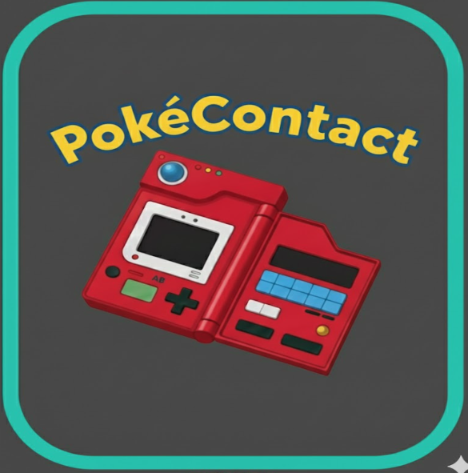

---

[]()
[]()
[]()

</div>

---

# Sobre la Aplicación

**PokeContact** es una aplicación desarrollada con **React Native + Expo** que transforma tu lista de contactos en una experiencia temática inspirada en una Pokédex.  
Cada contacto tiene un Pokémon asignado, estadísticas, detalles visuales y animaciones únicas.

---

# Características Principales

### **Home Screen**
- Búsqueda de contactos  
- Filtros dinámicos  
- Visualización de Pokémon, estadísticas y datos del contacto  

### **Add Contact**
- Añadir contactos con Pokémon asignado aleatoriamente  
- Buscar Pokémon manualmente  
- Vista previa del contacto antes de añadirlo  

### **Contact Details**
- Ver estadísticas completas del Pokémon asignado  
- Animaciones  
- Información extendida del contacto  

### **Trade Screen** *(En desarrollo)*
- Intercambiar contactos mediante JSON  
- Compatibilidad futura con QR  

### **Animaciones y UI**
- Animaciones vistosas  
- Estilo inspirado en Pokédex futurista  
- Sonidos, transiciones y efectos  

### **PokéAPI Integration**
- Datos reales y actualizados  
- Estadísticas, sprites, tipos y más

---

# Capturas de Pantalla

Organizadas por categorías:

---

## **Pantallas Principales**
<div align="center">
  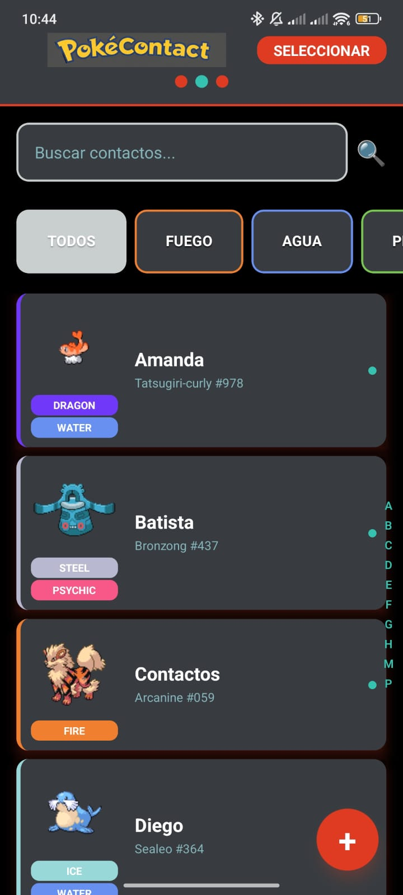
  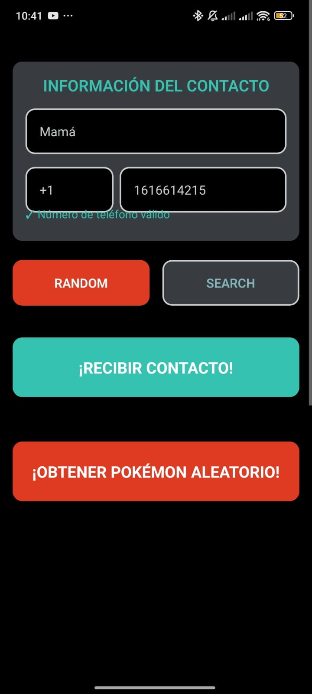
</div>

---

## **Selección y Captura**
<div align="center">
  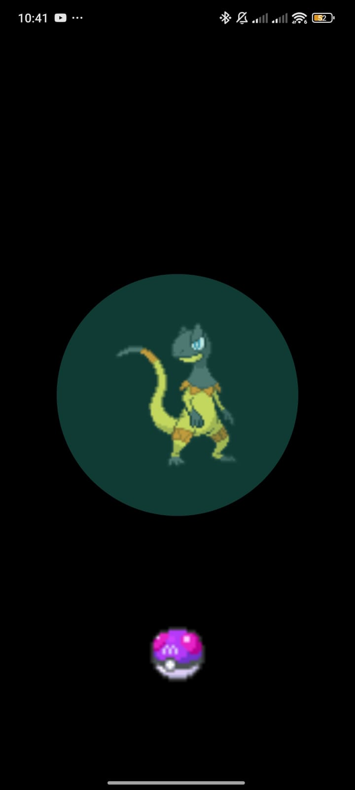
  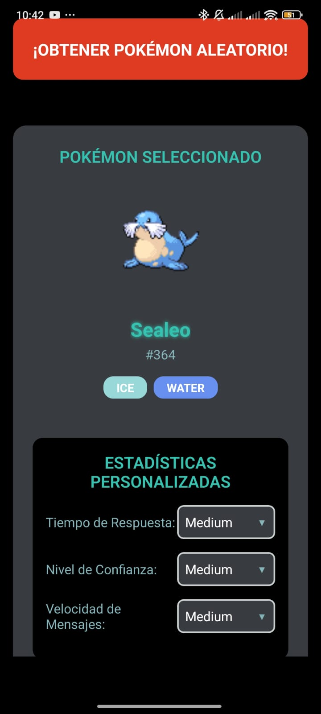
  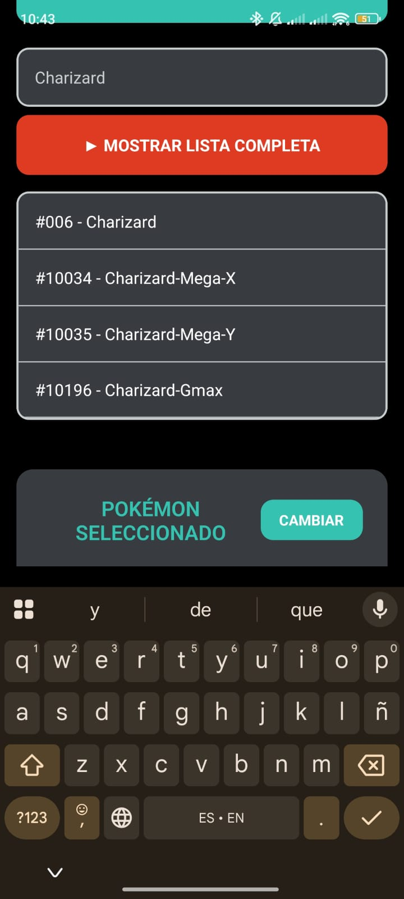
</div>

---

## **Filtros y Búsqueda**
<div align="center">
  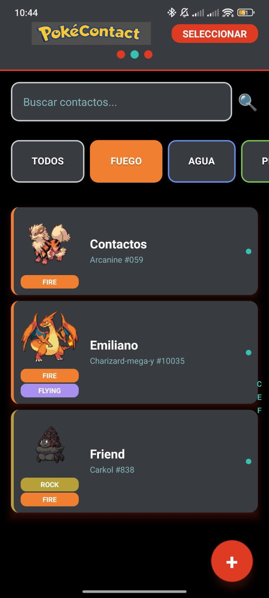
  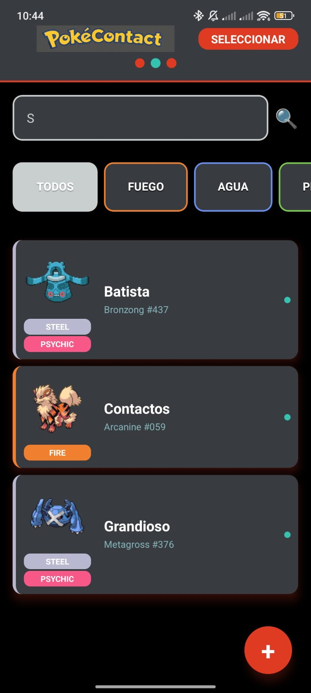
</div>

---

## **Detalles del Contacto**
<div align="center">
  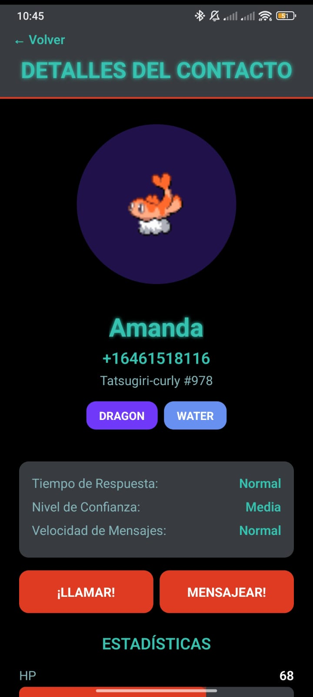
  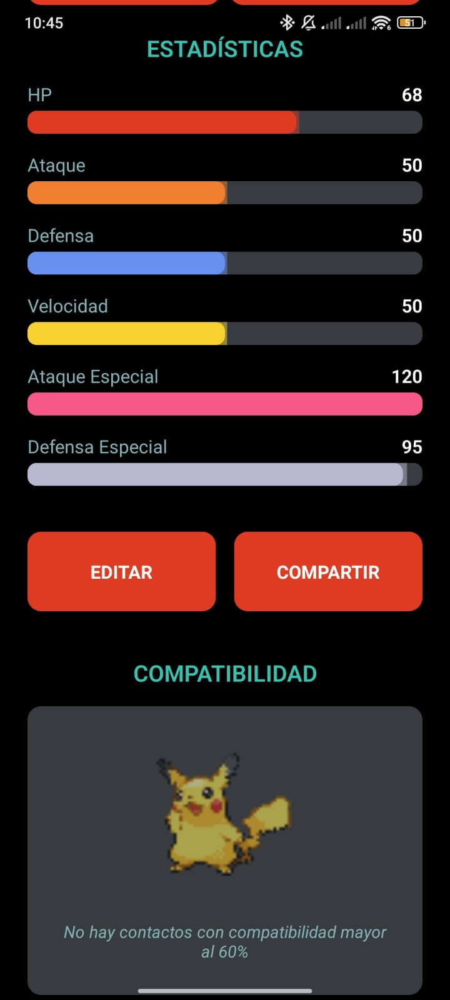
  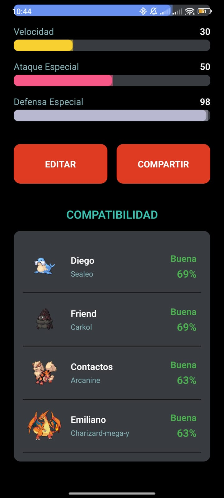
</div>

---

# Instalación

### 1. Instalar dependencias
```bash
git clone https://github.com/EmilianoChacon/PokeContact.git
cd PokeContact
npm install
npx expo start


npm install -g eas-cli
eas build -p android --profile preview
```
---

---

# Descargar APK

Descarga aquí la versión más reciente de **PokeContact** para Android.

<div align="center">
  <a href="https://github.com/EmilianoChacon/PokeContact/releases/download/contacts/PokeContact.apk">
    
  </a>
  <br><br>
  <a href="https://github.com/EmilianoChacon/PokeContact/releases/tag/contacts">
    Ver página del release
  </a>
</div>


---

# Estructura del proyecto
```bash
pokecontact/
├── components/
│   ├── ContactCard.js
│   ├── PokemonStatsBar.js
│   └── CaptureAnimation.js
├── screens/
│   ├── HomeScreen.js
│   ├── AddContactScreen.js
│   ├── ContactDetailScreen.js
│   └── TradeScreen.js
├── services/
│   ├── pokeApi.js
│   └── storage.js
├── assets/
│   ├── images/
│   └── sounds/
├── theme.js
└── App.js
```
---

# Tecnologías utilizadas

| Tecnología                   | Uso                        |
| ---------------------------- | -------------------------- |
| React Native                 | Base del desarrollo móvil  |
| Expo                         | Entorno y herramientas     |
| React Navigation             | Navegación entre pantallas |
| Axios                        | Llamadas a PokéAPI         |
| AsyncStorage                 | Persistencia local         |
| React Native Reanimated      | Animaciones avanzadas      |
| React Native Animatable      | Transiciones               |
| Expo AV                      | Sonidos                    |
| React Native QR Code SVG     | Generación de códigos QR   |

---

# Diseño

El diseño está inspirado en una Pokédex moderna:
 Rojo primario: #E3350D
 Verde neón: #39FF14
 Texturas metálicas y estilo futurista
 Efectos LED
 Transiciones suaves y animaciones vistosas
